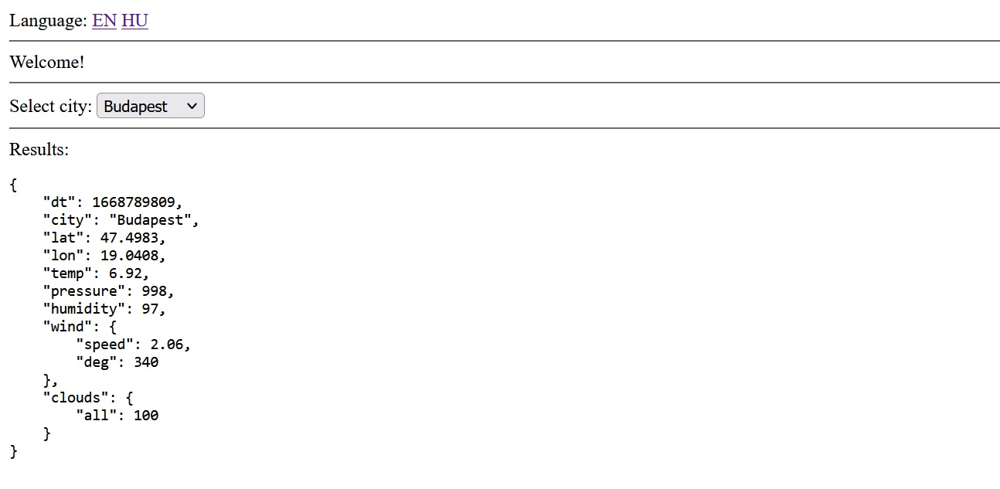

# OpenWeatherMap client

To start:
> npm run dev

The page <http://localhost:8080> just prints the results of the API call like this:

## Implementation details

There is an index page callable with an optional language code, where cities from the cities.json file are selectable. I used mustache to implement the language support.
 
On selection it calls the /api path with a city parameter to get the current weather information from openweathermap.org. The results are cached in a db.json file for 10 minutes. 

WeatherService implements the logic, WeatherServiceApi serves the http requests. 

Logs are written into a request.log and error.log file. The city info is cached too since it probably never changes. 

DB and log files are optional and can be turned off in the dotenv config file. 

There is some error handling on the server, on the client side errors are simplified into 2 categories request or server error. 

I will commit the log files for documentation.

